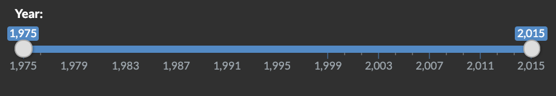

Crime data browser
================
Reza Bagheri and Weifeng Davy Guo
2019-01-24

Our app can be viewed at: <https://davygriffin.shinyapps.io/crime_data_browser/>.

### Feedbacks and changes

After the feedback session, we received 2 feedbacks from other groups and TA as well. Here is a list of issues and the changes that we made to resilve them:

+ I would suggest to change the plot colour based on the type of crime user selects  
*The app now plots each crime category with a different color* 
+ It would be better to rotate the names of the cities to avoid overlap  
*We have rotated the text label in the bar charts*
+ Two of your widgets at the bottom are only used for barplot - please either hide them until the user selects this option or make it otherwise more clear 
*There are now line separators for each section on the panel with titles and there are also some help texts on the panel that describe the widget functions* 
+ The state widget doesn't work for a barplot  
*This is not a bug. The bar plot shows the country-wide data not the state data. That's becasue most of the states only have one city. We added a helptext to the pannel to calrify what it is plotting.* 
+ I would add an "all cities" feature for the line plot so that the user can see the average for all cities in the selected state 
*Now there is a second plot on the bottom that shows the average values for each state* 
+ For the "number of cities" widget I would suggest having an option to select one city or somehow take care of the states that only have one city in the list 
*You can now select one city from the slider* 
+ Some of your functions, for example, ggplot for barplots and ggplotly are repeated several times in the code with the same parameters. You can try to write a function to avoid repetition 
*We now have functions to plot the data for each crime category* 

During the "Fly on the wall session", both of the groups were play around focus on our 1st scenario which is the history crime record of one specific city and we were expecting them to do so. However, neither of the groups found our 2nd scenario which is displaying crime statics of several top/bottom cities of one specific year. After we showing them about this in the informed-run, we recieved positive feedback about this design. This difference make us realized that, one of the design flaw is we didn't show our app's function or features obviously and entirely. Users are supposed to easily get the app by clicking around. As we assumed, the slide bar of year mislead the users to only focus on selecting the year range. They didn't noticed or tried to explore the possibility of put the two buttons together to "activate" the second scenarioes.

Another minor flaw brought up by other groups is that in the sorting scenarioes, when the user chose the maximum number of cities, which is 15, the x-axis is overlapped by city names so it was very hard to read. We are tilting the direction of the words so that cities can be display clearly.

Some feedback suggest that for the crime data comparsion, we should consdiering put the different crime type in one plot or using stacked bar. Our purpose is for users to view simple and clear data, while put too much data in one plot may be confused to user, especially when the number of cities increases. Hence, we will keep our straightforward display.

### Reflection on the feedback from TA

We've made following changes based on TA's feedback and suggestion:

-   "I would suggest to change the plot colour based on the type of crime user selects"

We've changed plot colour based on the type of crime, both line chart and bar chart.  

-   'It would be better to rotate the names of the cities to avoid overlap."

We're currently working on that.

-   "Please add more ticks for the year axis for clarity."

Ticks has been added. 

-   "Two of your widgets at the bottom are only used for barplot - please either hide them until the user selects this option or make it otherwise more clear""

We've fix this flaw by add instruction note to the slide bar, the users would be instructed to use the second function. 

-   "The state widget doesn't work for a barplot."

It shouldn't work as we designed in that way on porpose. For the bar plot, it shows the comparison of the top n cities or bottom n cities. Select sepcific cities wouldn't make sense.

-   "I would add an "all cities" feature for the line plot so that the user can see the average for all cities in the selected state"

Function added per request, now users can see the average plot below the line chart. 

-   "For the "number of cities" widget I would suggest having an option to select one city or somehow take care of the states that only have one city in the list"

As mentioned earlier, the bart shows the comparison of the top n cities or bottom n cities. Select one city doesn't make sense, if the user need to see one cities data, this could be fully fuctioned in the linew chart by moving the cursor to the data point, a tooltip will pop up displaying the data."

-   "Please make sure your variable names are more specific and informative"

We've made changes to make it more informative.

-   "For the year widget, you can also play around and try to implement a range text box - ie if a user puts in the same year in both text boxes, the graph will change into a barplot. The functionality in this case might be a bit more clear."

We've been considering using a year text boxes to let the user input their target range or specific year, but we still want to let the user only using mouse/cursor in the app. Hence, we're keeping the slide bar.

### Updates since Milestone 2

As mentioned earlier, we focus on improve the design of the app since milestone2.

-   We've add another line chart to dispaly the average statstics in selected state.

-   We've changed the theme to made the app more formal.

-   We've change the chart color based on crime type so user will clearly see the difference.

-   We've add insturctive notes to guide the user explore the app.

-   We've made minor design change (like ticks) per feedback.

-The most important feature we achieved is the prediction funtion using linear regression. The user input a year later than 2015 then click "add", a prediction point and the model line in dash will display and the averarge data chart will be hidden. In this way, the user may have a general idea about how the crime rate will change in the future. When the user is done with prediction result. clicking "remove" will restore the app to default play. 

We are glad to see that all features of our proposal has been achieved. Hence, our objective remain unchanged.
