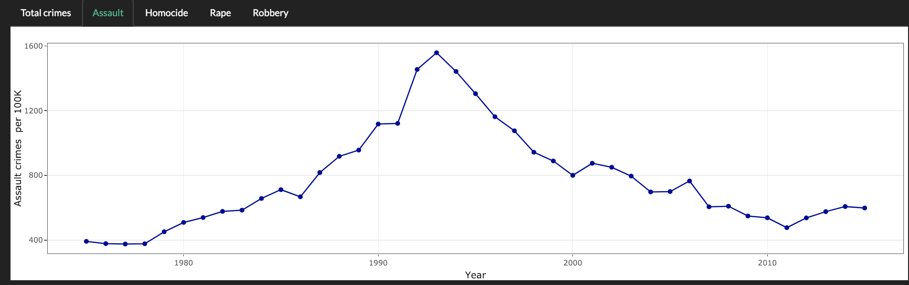
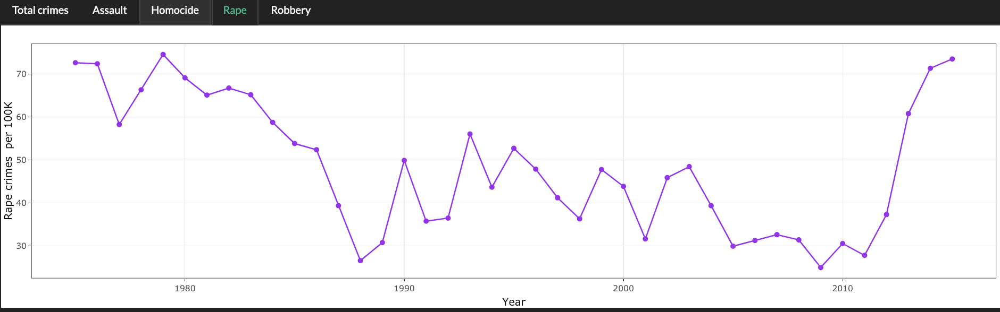
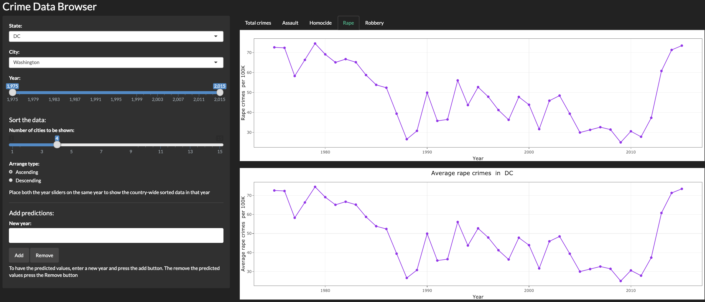
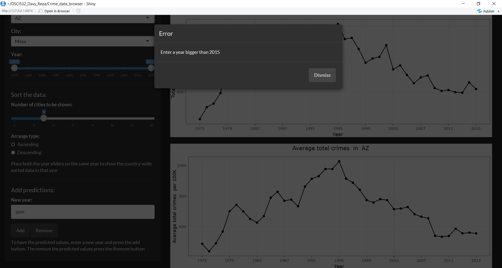
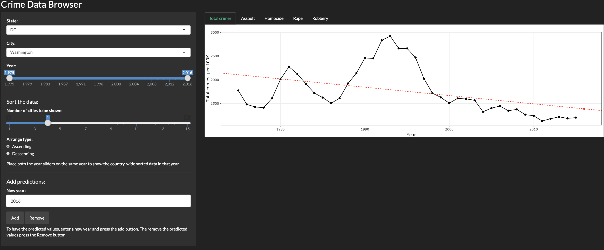

Crime data browser
================
Reza Bagheri and Weifeng Davy Guo
2019-01-24

Our app can be viewed at: <https://davygriffin.shinyapps.io/crime_data_browser/>.

### Feedbacks and changes

We've made following changes based on TA's feedback and suggestion:

-   "I would suggest to change the plot colour based on the type of crime user selects"

*We've changed plot colour based on the type of crime, both line chart and bar chart.* 

-   'It would be better to rotate the names of the cities to avoid overlap."

*They are rotated now.*

-   "Please add more ticks for the year axis for clarity."

*More ticks have been added.*

-   "Two of your widgets at the bottom are only used for barplot - please either hide them until the user selects this option or make it otherwise more clear""

*There are now line separators for each section on the panel with titles and there are also some help texts on the panel that describe the widget functions.*

-   "The state widget doesn't work for a barplot."

*This is not a bug. The bar plot shows the country-wide data not the state data. That's because most of the states only have one city. We added a help text to the panel to clarify what it is plotting.*

-   "I would add an "all cities" feature for the line plot so that the user can see the average for all cities in the selected state"

*Now there is a second plot on the bottom that shows the average values for each state.* 

-   "For the "number of cities" widget I would suggest having an option to select one city or somehow take care of the states that only have one city in the list"

*You can now select one city from the slider.*

-   "Please make sure your variable names are more specific and informative"

*We've made changes to make it more informative.*

-  "Some of your functions, for example, ggplot for barplots and ggplotly are repeated several times in the code with the same parameters. You can try to write a function to avoid repetition"

*We now have functions to plot the data for each crime category.*

-   "For the year widget, you can also play around and try to implement a range text box - ie if a user puts in the same year in both text boxes, the graph will change into a barplot. The functionality in this case might be a bit more clear."

*We have added a help text below the slider bar to explain how it works.*

After the feedback session, we received 2 feedbacks from other groups and TA as well. Here is a list of issues and the changes that we made to resilve them:

We also received some feedback from other groups. The feedbacks were generally positive. They believed that the role of year slider to show the bar charts is hidden and not clear. So we added a help text below the slider to clarify that. They had a comment about the rotation of the text label of the bar chart and using different colors in the plots which were addresses before.
They also suggested to show all the categories in one plot. However, we decided not to do that. That is because we adding the predictions and showing all the curves with their regression lines and new points makes the plot very crowded and difficult to read.

### Updates since Milestone 2

As mentioned earlier, we focus on improve the design of the app since milestone2.

-   We have added a dark theme to the app.

-   We've added another line chart to display the average statistics in selected states.

-   We've change the chart color based on crime type so user will clearly see the difference.

-   We've added help text to the panel and divided it with lines to help the user how to use the app.

-   We've made minor design change (like ticks) per feedback.

-   We've added functions and lots of comments to the code

-The most important feature we achieved is the prediction function using linear regression. The user should enter a year after 2015 and  then click "Add" button. If the user enters a a year before 2015 or something which is not a number, the app will show an error message.

After pressing the button a linear regression will be done on the whole data set and the new values for each crime category will be calculated for the new year. The new data point and regression line will be shown in the line plot. The user can switch between tabs or even switch to the bar plots to see the sorted data for the new year. If the user selects a year range after 2015 and before new year, the app will give a warning that no data is available to show.

By pressing the 'Remove' button all the predictions will be removed from the plot. When you do a regression analysis, it is possible that you end up with negative numbers for your prediction. This may happens for the cities that have a declining crime rate. In that case showing a negative crime rate may be meaninless, so the app sets the negative numbers to zero.

We are glad to see that we have implemented all the features of our app according to our proposal. Hence, our objectives remain unchanged.
