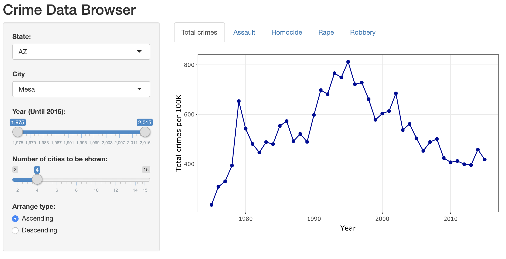
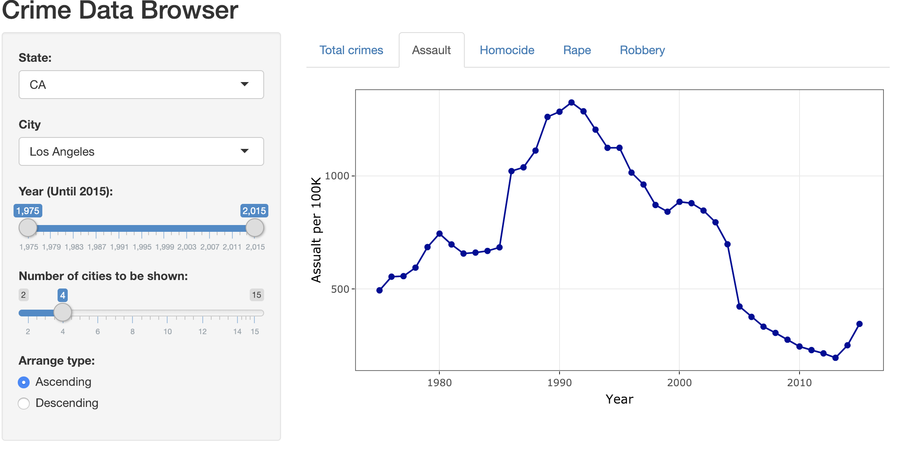
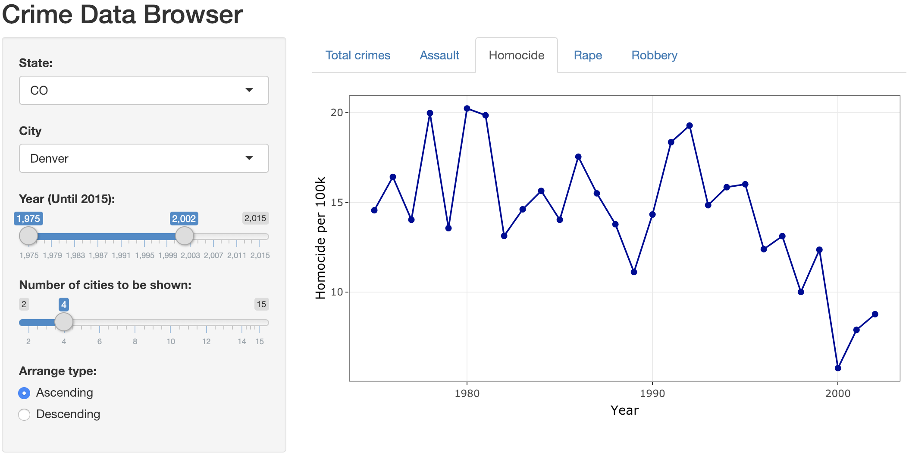
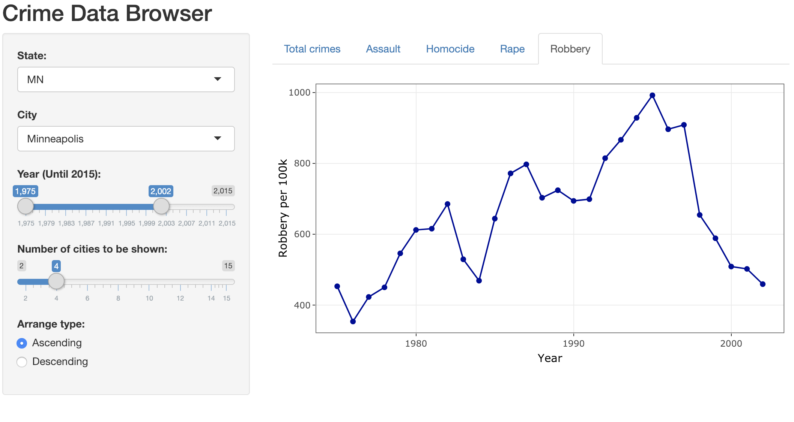
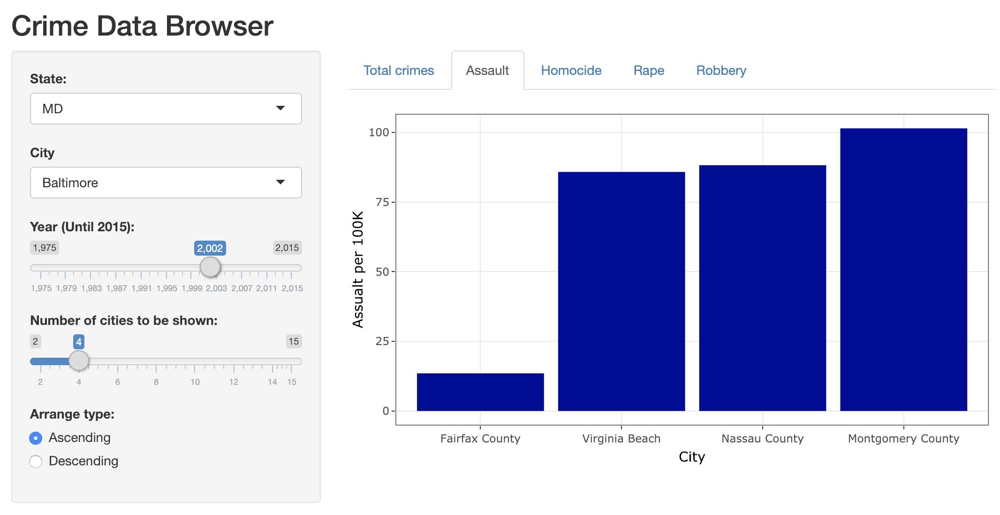
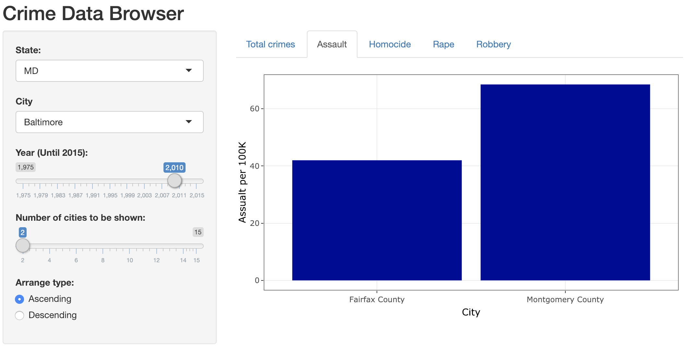
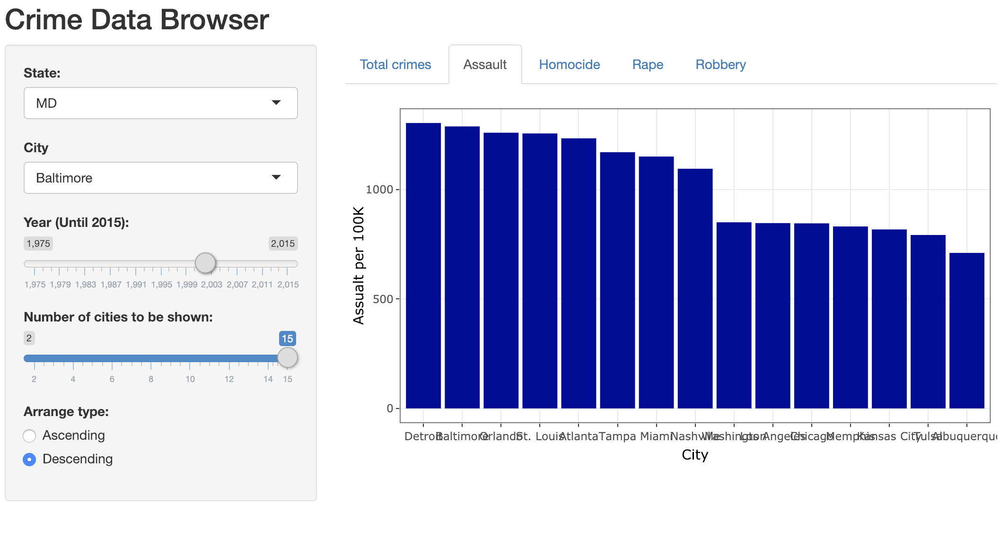

Crime data browser
================
Reza Bagheri and Weifeng Davy Guo
2019-01-19

Our app can be viewed at: <https://davygriffin.shinyapps.io/crime_data_browser/>.

### Rationale

In our proposal, we came out with two scenarios related to our app *crime data browser*. For the `Plotting the data and prediction` part, we choose using line plot to plot the history data of a chosen city from chosen state. For the `Sorting the data` part, we use a bar chart to compare the sorted crime data for several cities for a selected year in ascending or descending order.

### Functionality

Once logged in the app, the user can see a layout showed as below: 

User can select state, city and the year range, a line plot will show up to display the historical data within the selected year range. The chart will update automatically if the user changes their selection of state, city or year range:

We have 5 separated tabs to show the data based on crime type. In this way, user could view the data in a more detailed way:

 

If the user places both the min and max of the year slider at the same value, the line plot will turn into a bar chart a bar chart which displays the sorted crime data for that year in a ascending or descending order.  

And the user can determine how many cities should be displayed (from at least 2 to at most 15) in that bar plot:
 

If the user hovers the mouse over a plot, a tooltip will be shown which gives the coordinate (x and y values) of the closest data point in that chart. In addition, the input widgets of the app also have tooltips which can tell the user how they work.

### Visions & unfinished steps

In the original proposal we had submit buttons to switch between the line plots and bar charts, but based on the received feedback from the TA we decided to remove and use the year slider to change the display mode of the app. This new layout looks simpler and more interactive.
Based on our visions, we are working on the prediction section of the app next week. We couldn't finish it since we had no time. By adding this feature, the user can first select a new year after 2015. The app will do a linear regression on the historical data and calculates the new crime rates for all the cities at that new year. These new data points will be added to the historical data and can be displayed beside them in both the line plot and bar chart. The user can remove or replace that new year if desired.

