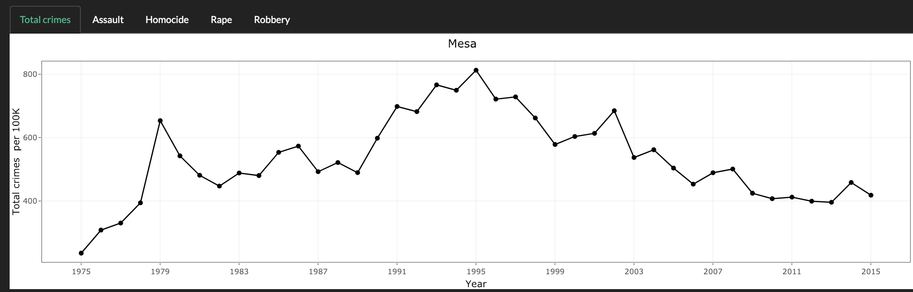
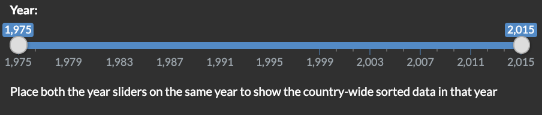
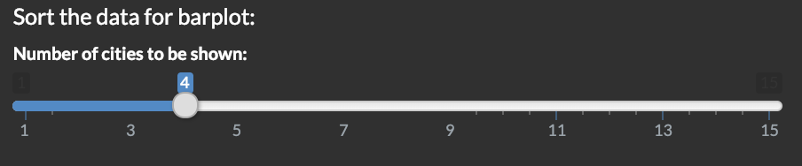
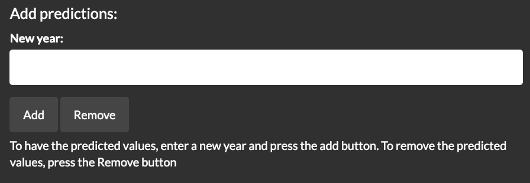

Crime data browser
================
Reza Bagheri and Weifeng Davy Guo
2019-01-19

Our app can be viewed at: <https://davygriffin.shinyapps.io/crime_data_browser/>.

### "What changes did you decide to implement given the time limit, and why do you think this is the best thing to focus on?"

Since we've achieved all the feature we proposed and the time limit, we've decided to focus on the improvement based on TA's feedback. The feedback is the best thing to focus on due to we've valued the feedback.

-   "I would add the title to the top plot and indicate the city plotted"

-   "The help text about the year widget could be moved under it, so it is more clear."

-   "Also, I would say smth along the lines of "Sort the data for a barplot" to make it crystal clear which graphs those widgets affect"

-   "You have a typo in the predictions widget text - 'To remove' instead of 'The remove' "

We made the following changes:

-   Title of the city plotted added. 

-   Help text relocated. 

-   Instruction text added. 

-   Typo corrected. 

### "If you were to make the app again from scratch (or some other app in general), what would you do differently?"

If we redo the app again, we will consider about removing some of the feature. Either the "sorting data" scenario or "prediction" function.

1.  For the sorting data scenario, it didn't fit perfectly with the layout of the whole app, users feedback shows that this scenario is not as straightforward as the line chart. We may give it a second thought.

2.  For the prediction part, it mainly because of the accuracy of linear regression model. The result of the prediction only shows a result while have no proof to backup the number

### "What were the greatest challenges you faced in creating the final product?"
