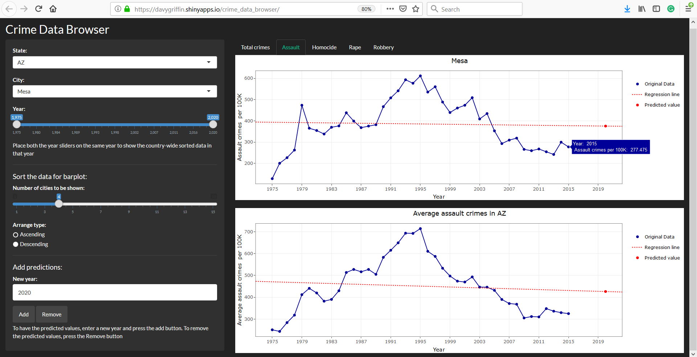

Crime data browser
================
Reza Bagheri and Weifeng Davy Guo
2019-01-19

Our app can be viewed at: <https://davygriffin.shinyapps.io/crime_data_browser/>.

For this last milestone we first dealt with the feedbacks received from the previous milestone. Here are some changes that we made:

-   We added the name of the city to the title of the top plot. The bar plots also show the name of the city now.

-   The help text for the year widget is now placed under it.

-   We changed the help text for the bar plot section to make it more clear.

-   We fixed the typo in the  predictions section help text. 

-   We changed the name of some of the variables to make them more meaningful.

In addition, we added some more features to our app:

-   We added a dynamic legend to the prediction plot. Now, when you switch to the prediction mode, the legend appears on the line plot. This makes it easier ode the user to read plot.

-   The prediction line was also added to the plot for the average state data. So now can also predict the average data for each state.

-   We changed the plot tooltips to show the truncated numbers. Now the numbers only have three digits after the decimal point. This makes the tooltip more useful.

Based on what we learned from this project, if we were to make this app again, we wouldn't add the "prediction" part. It took a lot of time to write the code and debug it, but it didn't improve the user interface. We could focus on adding more visual items like 'maps' so that our app looks better. These features would be much easier to implement, and we could save our time. 
Our year slider was initially very confusing, so we would design it differently. We would write more functions in our code from the beginning.  
The greatest challenges in this course was the lack of training. The lectures had nothing to do with the labs, and we had no previous experience with R programming and Shiny app. 
When using Shiny app, you cannot use some of the R studio features like the variable viewer, so debugging the code is much more difficult, and we never learned anything about debugging it in the lectures. So, it took us a lot of time to learn how to debug the code efficiently. Another challenge was the lack of time. In a week with three exams and three other labs, you can hardly find a time to finish a coding project like this. We could write a simpler proposal and focus on designing a more elegant interface for our app.  
 
